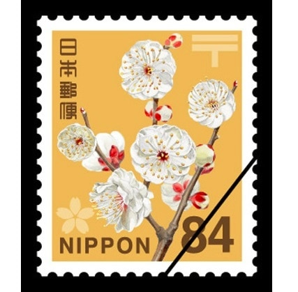

# 事務関連マニュアルについて
## 休日出勤について
前日の昼までに上長と相談の上、社長へ個別に申請します。

**休日出勤時のタイムカードの打刻漏れ**には特に中止してください。
最悪、認められないケースも発生するので、慎重に対応をお願いします。

## 経費の精算について
主な詩的項目は次の通りです。
-資料代
-通信費
-消耗品費

│摘要 │内容
│--│--
│資料代 │書籍 有料アプリ
│通信費 │切手 宅配便料金
│小耗品費 │文具 台所用品

## 宅配便の発送について
## プリンタについて
## 大容量データの送受信について
## 電話、来客対応について
## ごみの収集について
## プリンタについて
## 大容量データの送受信について

何かほかに書くことがあったような気がするけど......